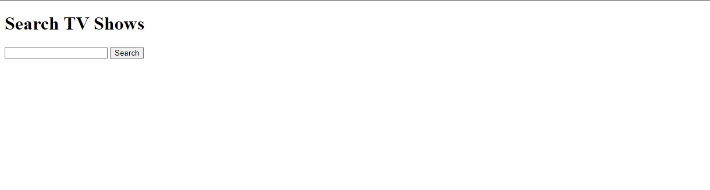
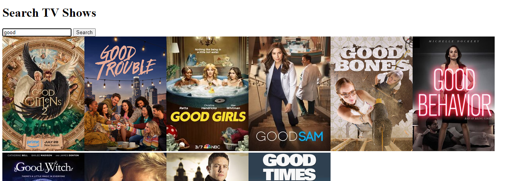

# TV Show Search Application - Web Bootcamp Project

This repository contains a TV Show Search Application that I built as part of Udemy's Web Development Bootcamp by Colt Steele. The application allows users to search for TV shows and provides information about the shows using data fetched from an open-source API.

## Preview

## Live Site

[Link to Live Site](https://mbilal-x.github.io/web-bootcamp__TV-Maze-API-App)

## Features

- Search functionality to find TV shows
- Fetching data from an open-source API
- Displaying tile of tv-shows
- Responsive design for various screen sizes
- Simple and intuitive user interface

## Technologies Used

- HTML
- CSS
- JavaScript (for fetching data and handling UI)

---
Feel free to explore the project, use it as a reference, and contribute to its improvement. If you have any questions or suggestions, please feel free to reach out. Happy coding! 😊
